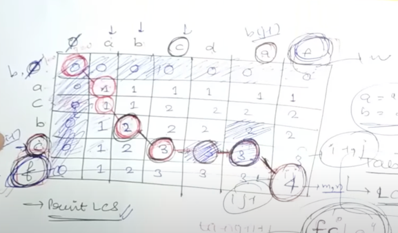

# Dynamic Programming
DP is optimised recursion.

**Identification:**
1. Identifications of recursion ie. choices and decisions.
2. Optimal value is asked. Keywords like maximum, minimum, optimal is used.

**Identification of Knapsack Problems:**
- choices is present
- wt[] is given
- val[] may be present
- W(capacity) is given

**Recursive Approach to Knapsack Problem**
```java
class Knapsack01Recursion
{
    static int knapsack01(int[] wt, int[] val, int W, int n){

        if(n==0 || W == 0){
            return 0;
        }
        if(wt[n-1] <= W){
            return Math.max(val[n-1] + knapsack01(wt,val,W-wt[n-1],n-1),  knapsack01(wt,val,W,n-1));
        }
        else{
            return knapsack01(wt,val,W,n-1);
        }
    }
}
```
**Memoized Recursive Approach to Knapsack Problem**
```java

public class Knapsack01Memoized {
    static int[][] dp = new int[1001][1001];

    static int Knapsack01(int[] wt, int[] val, int W, int n) {

        if (n == 0 || W == 0) {
            return 0;
        }
        if (dp[n][W] != -1)
            return dp[n][W];

        if (wt[n - 1] <= W) {
            return dp[n][W] = Math.max(val[n - 1] + Knapsack01(wt, val, W - wt[n - 1], n - 1), Knapsack01(wt, val, W, n - 1));
        } else {
            return dp[n][W] = Knapsack01(wt, val, W, n - 1);
        }
    }
}
    
```
**Top-Down Approach**
```java
public class Knapsack01TopDown {
    static int[][] dp = new int[1001][1001];

    static int knapSack(int W, int wt[], int val[], int n) {
        // your code here
        //Arrays.stream(dp).forEach(row->Arrays.fill(row,-1));
        for (int i = 0; i < n + 1; i++) {
            for (int j = 0; j < W + 1; j++) {
                if (i == 0 || j == 0)
                    dp[i][j] = 0;
                else
                    dp[i][j] = -1;
            }
        }
        for (int i = 1; i < n + 1; i++) {
            for (int j = 1; j < W + 1; j++) {
                if (wt[i - 1] <= j) {
                    dp[i][j] = Math.max(val[i - 1] + dp[i - 1][j - wt[i - 1]], dp[i - 1][j]);
                } else
                    dp[i][j] = dp[i - 1][j];
            }
        }
        return dp[n][W];
    }
}
```
**Variations of Knapsack:**
1. Subset Sum
2. Equal Sum Partition
3. Count of Subset sum
4. Minimum subset diff
5. Target Sum
6. "#" of subset c given d/f 

**Unbounded Knapsack**\
It is similar to 0-1 Knapsack problem just that
we can pick same item any no of times.

**Code Change from 0-1 Knapsack**
* Recursive: \
  if(wt[n-1] <= W){
  return Math.max(val[n-1] + knapsack01(wt,val,W-wt[n-1],n),  knapsack01(wt,val,W,n-1));
  }
* Memoized\
  if(wt[n-1] <= W){
  return dp[n][W] = Math.max(val[n-1]+recursiveApproach(n,W-wt[n-1],val,wt,dp),recursiveApproach(n-1,W,val,wt,dp));
  }
* TopDown \
  if(wt[i-1]<=j)
  dp[i][j] = Math.max(val[i-1]+dp[i][j-wt[i-1]],dp[i-1][j]);

**Longest Common Subsequence:** \
A longest common subsequence (LCS) is the longest subsequence common to all sequences in a set of sequences (often just two sequences). \
It differs from the longest common substring: unlike substrings, subsequences are not required to occupy consecutive positions within the original sequences.

Recursive Approach:
```java
public class LongestCommonSubsequence {
    static int recursiveApproach(String x, String y, int m, int n) {
        if (m == 0 || n == 0) {
            return 0;
        }
        if (x.charAt(m - 1) == y.charAt(n - 1)) {
            return 1 + recursiveApproach(x, y, m - 1, n - 1);
        } else
            return Math.max(recursiveApproach(x, y, m - 1, n), recursiveApproach(x, y, m, n - 1));
    }}
```
Memoized Recursive Approach:
```java
class lcs{
static int memoizedApproach(String x, String y, int m, int n, int[][] dp) {
        if (m == 0 || n == 0) {
            return 0;
        }
        if (dp[m][n] != -1) {
            return dp[m][n];
        }
        if (x.charAt(m - 1) == y.charAt(n - 1)) {
            return dp[m][n] = 1 + memoizedApproach(x, y, m - 1, n - 1, dp);
        } else
            return dp[m][n] = Math.max(memoizedApproach(x, y, m - 1, n, dp), memoizedApproach(x, y, m, n - 1, dp));
    }}
```
Bottom-Up Approach: 

```java
class LCS{
  static int topDownApproach1(String x, String y, int m, int n, int[][] dp) {
    for (int i = 1; i < m + 1; i++) {
      for (int j = 1; j < n + 1; j++) {
        if (x.charAt(i - 1) == y.charAt(j - 1)) {
          dp[i][j] = 1 + dp[i - 1][j - 1];
        } else
          dp[i][j] = Math.max(dp[i - 1][j], dp[i][j - 1]);
      }
    }
    return dp[m][n];
  }
}
```
Variations of lcs:
1. LongestCommonSubstring \
Here we need to explicitly find max amount matrix because dp[m][n] represents longest common substring ending with last char of both string.
```java
public class LongestCommonSubstring {
    static int longestCommonSubstr(String S1, String S2, int n, int m) {
        int[][] dp = new int[n + 1][m + 1];
        int max = 0;
        for (int i = 1; i < n + 1; i++) {
            for (int j = 1; j < m + 1; j++) {
                if (S1.charAt(i - 1) == S2.charAt(j - 1)) {
                    int currVal = 1 + dp[i - 1][j - 1];
                    max = Math.max(max, currVal);
                    dp[i][j] = currVal;
                } else dp[i][j] = 0;
            }

        }
        return max;
    }}
```


2. ShortestCommonSuperSequence:
Super sequence means final string should contain both the sequence of string s1 and s2 .
s1 = AGGTAB
s2 = GXTXAYB
result = AGGXTXAYB
